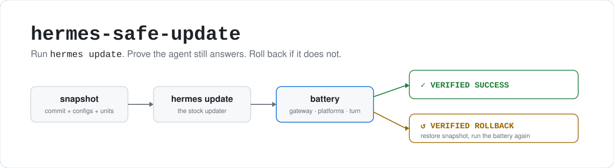
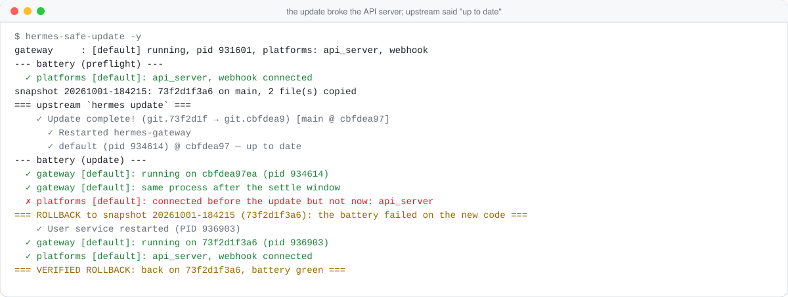

<p align="center">
  <picture>
    <source media="(prefers-color-scheme: dark)" srcset="assets/hero-dark.svg">
    
  </picture>
</p>

<p align="center">
  <a href="https://github.com/CocaKova/hermes-safe-update/actions/workflows/ci.yml"></a>
  
  
  
  <a href="LICENSE"></a>
</p>

[Hermes Agent](https://github.com/NousResearch/hermes-agent) moves fast, and its updater is good.
It pulls, migrates your config, syncs dependencies, restarts every gateway under whatever runs
it, and checks that they all run the new commit. What it can't tell you is whether your agent
still **answers**. A gateway can be up while a plugin failed to load, a platform never
reconnected, or every turn errors. You find out when you message your agent and nothing comes back.

`hermes-safe-update` wraps the stock updater:

1. It runs a battery of checks on the install you have now. If that already fails, it stops
   there, since an update could then only "fail" for reasons that have nothing to do with it.
2. It snapshots the commit you run, every `config.yaml`, and the gateway's service definition.
3. It runs plain `hermes update`, exactly as you would.
4. It runs the battery again: every gateway is up on the new commit and stays up, every platform
   that was connected is connected again, nothing failed to load, a real agent turn answers,
   and any checks you added pass.
5. If anything fails, it restores the snapshot and runs the battery on that too, so you know
   where you stand either way.

One Python file, standard library only. It doesn't patch Hermes or change how it updates.

## Quick start

```sh
curl -fsSL -o ~/.local/bin/hermes-safe-update \
  https://raw.githubusercontent.com/CocaKova/hermes-safe-update/main/hermes-safe-update
chmod +x ~/.local/bin/hermes-safe-update

hermes-safe-update --verify   # the battery against what runs now; changes nothing
hermes-safe-update            # update, verify, roll back on failure (asks first)
```

On Windows, save the file anywhere and run it with `python hermes-safe-update`.

## What a rollback looks like

This is a real run from the test suite. The new commit quietly broke the API server. Upstream's
own post-update check reported the gateway as up to date on the new commit, which it was.
The platform check is what noticed the API server never came back.

<picture>
  <source media="(prefers-color-scheme: dark)" srcset="assets/rollback-dark.svg">
  
</picture>

## What the battery checks

| check | how | why it matters |
|---|---|---|
| gateway on the new code | each gateway's `gateway_state.json` says running, with `code_sha` = the checkout's commit | an old process still serving looks fine from outside |
| gateway stays up | same process after `--settle` seconds | a restart loop passes any single look |
| platforms reconnected | every adapter that was connected before the update is connected again | "it's up but nobody can reach it" is the most common bad update |
| nothing failed to load | Hermes logs (and the gateway's journal under systemd) since the update | plugins fail soft; the gateway runs on without them |
| a real turn | the agent must reply with a random token, through the gateway's API server when it runs, else `hermes -z` | the only check that proves model, prompt and agent loop all work |
| your checks | every hook in `checks.d/` | your setup is not anyone else's |

If no gateway was running before the update, the gateway checks are skipped and the turn goes
through the CLI. The turn costs one short request to your configured model; `--no-turn` skips it.

## Usage

```sh
hermes-safe-update            # update, verify, roll back on failure
hermes-safe-update -y         # no prompt (cron, scripts)
hermes-safe-update --check    # is there an update? changes nothing
hermes-safe-update --verify   # run the battery now; changes nothing
hermes-safe-update --list     # snapshots
hermes-safe-update --rollback 20261001-160702   # go back to a snapshot, verified
hermes-safe-update -- --branch main             # anything after -- goes to `hermes update`
```

Run `--verify` once before your first update. It should pass on a healthy install. If it
doesn't, fix that first (or the check), or every update will refuse to start.

<details>
<summary><b>All options</b></summary>

| option | default | |
|---|---|---|
| `-y`, `--yes` | ask | don't ask for confirmation |
| `--no-turn` | turn on | skip the agent turn (a slow local model can take minutes) |
| `--turn auto\|api\|cli\|off` | `auto` | force the turn through the gateway API or the CLI |
| `--ignore-platform NAME` | | don't require this platform to reconnect (repeatable), e.g. while Discord itself is down |
| `--skip-preflight-battery` | | update even though the install fails the battery now (when the update is meant to fix it) |
| `--allow-dirty` | refuse | update even with modified files in the Hermes checkout (a rollback discards them) |
| `--keep N` | 5 | snapshots kept after a success |
| `--settle N` | 20 | seconds a gateway must stay up on the new code |
| `--gateway-timeout N` | 180 | seconds to wait for a gateway to come up on the new code |
| `--restart-timeout N` | 180 | seconds to allow `hermes gateway restart` |
| `--platform-timeout N` | 90 | extra seconds for platforms to reconnect |
| `--turn-timeout N` | 300 | seconds for the agent turn |
| `--update-timeout N` | 3600 | seconds for `hermes update` itself |
| `--log-window N` | 15 | with `--verify`: minutes of logs to scan |
| `--home PATH` | `$HERMES_HOME`, else Hermes' default | which Hermes home |
| `--hermes PATH` | first `hermes` on `PATH` | which CLI to ask where the install is |

Environment: `HSU_CONFIG_DIR` (hooks folder), `HSU_API_URL` (where the API server listens, if
Hermes doesn't publish it), `HSU_HOOK_TIMEOUT` (seconds per hook, default 600).

Every run writes a log to `$HERMES_HOME/logs/safe-update/`.
</details>

### Exit codes

| code | meaning |
|---|---|
| **0** | verified success, or nothing to do |
| **1** | nothing changed: preflight refused, or upstream refused before changing anything |
| **3** | verified rollback: the update failed the battery; you are back on the snapshot and it is healthy |
| **4** | rollback unhealthy: the snapshot is back but still fails; look now |
| **5** | interrupted (Ctrl-C): nothing was rolled back; the message says how to |

## Hooks and your own checks

Put executables in `~/.config/hermes-safe-update/` (Windows: `%APPDATA%\hermes-safe-update\`,
anywhere: `$HSU_CONFIG_DIR`). They run in name order:

| folder | when | if it fails |
|---|---|---|
| `pre.d/` | before the snapshot | the run stops, nothing touched |
| `restart.d/` | after the new code is in, and again after a rollback, before the battery | rollback |
| `checks.d/` | at the end of every battery, before and after the update | the battery fails |
| `post.d/` | at the end, whatever happened (`HSU_RESULT` says what) | logged |

Hooks get `HERMES_HOME`, `HERMES_BIN` (the CLI that matches the checkout right now),
`HERMES_TREE`, `HSU_HEAD`, `HSU_PHASE` (`preflight`, `update`, `rollback`, `verify`) and, in
`checks.d`, `HSU_GATEWAY_PIDS`. On Windows, hooks run by extension: `.cmd`, `.bat`, `.ps1`,
`.py`, `.exe`.

[`examples/`](examples) has working ones: a turn that must call a tool, a dashboard probe,
restarting your own systemd units onto the new code, and pausing timers during the update.

```sh
mkdir -p ~/.config/hermes-safe-update/checks.d
cp examples/checks.d/20-tool-turn ~/.config/hermes-safe-update/checks.d/
```

Anything you run around Hermes that imports its code (a custom dashboard, a bridge, a sidecar)
is not restarted by upstream. Restart it in `restart.d/`, or it keeps running the old code.

## Snapshots and rollback

A snapshot is a git ref, `refs/hermes-safe-update/<id>`, at the commit you were running (a ref,
not a branch, so it never shows in `git branch` or confuses the updater), plus copies of
`config.yaml`, `profiles/*/config.yaml` and the gateway's service definition (systemd user
units, the launchd plist, the Windows launcher script) under `$HERMES_HOME/safe-update/<id>/`.

A rollback:

1. puts the checkout back on the same branch (or the same detached commit, for release
   channels) at the snapshot commit
2. restores those files, keeping the rejected versions next to the snapshot
3. re-syncs dependencies for the restored code
4. restarts each gateway that was running (through its service, or detached if it ran in a
   terminal, like upstream's updater does)
5. runs your `restart.d/`, then the battery

Before any of that, preflight refuses to start when tracked files in the checkout are modified
(a rollback would destroy them), or when another Hermes home's gateway holds this host (Hermes
allows one gateway per host, so the updated one could not start).

A rollback doesn't pin anything. Upstream still has the commit that failed, so the next run tries
it again and rolls back again until upstream fixes it. It also doesn't undo session or memory
databases (Hermes migrates those forward-compatibly and keeps its own pre-update backup, see
`updates.pre_update_backup`), or anything your hooks changed.

## Where it runs

| | supported | tested |
|---|---|---|
| Linux, gateway as a systemd user service | yes | CI every week against current upstream, and on a real server |
| macOS, gateway under launchd | yes | CI every week against current upstream |
| Windows, gateway as a scheduled task | yes | CI every week against current upstream |
| gateway run in a terminal (`hermes gateway run`, tmux) | Linux and macOS: relaunched detached after a rollback, like upstream's updater does | CI on Linux and macOS |
| no gateway, CLI only | yes | CI |
| release channels (`stable`, `canary`) | yes: they leave a detached checkout, which a rollback restores as such | a detached checkout in CI; a real channel switch is not (the test upstream has no releases) |
| Docker, Nix, desktop-app installs | no: they update through their own channel | refused with a message |
| system-level systemd unit (`--system`) | partly: restarting it needs root, so a failed update may leave the restart to you | no |

CI has no model to talk to, so it runs with `--no-turn`. The agent turn (through the gateway's
API server and through `hermes -z`) is tested on a real install.

## Built to keep working

Hermes changes every day, and this tool reads some of its surfaces: a state file, a few CLI
flags, log wording. Two things keep that from turning into a tool that blocks your updates:

- **A check that can't run doesn't fail the update.** When a surface it reads is gone or
  renamed, the check reports `?` (could not check). An unknown is accepted only when a real agent turn
  answered, so the install is still proven to work.
- **Weekly CI against current upstream** on Linux, macOS and Windows runs every scenario below.
  When upstream changes something this depends on, it shows up there first.

## Why each piece exists

Every part of this came out of an update that went wrong on a real install:

- **Success means "the checkout moved forward and the battery passed", not an exit code.**
  Upstream can exit non-zero after a fully successful update, and `main` can move again while
  the update runs.
- **Dependency sync is finished before anything is verified.** The first Hermes start after a
  code change performs the pending sync; a service that starts at the same moment runs new code
  on old dependencies and crash-loops.
- **Service definitions are snapshotted.** A newer gateway can rewrite its own unit to a launcher
  the older code can't run, so restoring only the code leaves a gateway that never starts.
- **Every config is snapshotted, profiles included.** The updater migrates them in place, and old
  code reading a newer schema is undefined.
- **The agent turn uses a fresh session every time, then deletes it.** A reused test session
  taught the model to repeat its own earlier answers instead of exercising the code.
- **Platforms are compared with what was connected before**, so there's nothing to configure and
  nothing to keep current.
- **A foreground gateway is never restarted with `hermes gateway restart`.** Without a service
  manager, that command runs the gateway in the foreground of whoever called it.
- **Ctrl-C never triggers an automatic rollback.** The upstream updater gets the same signal and
  may still hold its lock; rolling back underneath it would race.

## Testing

[`tests/e2e.sh`](tests/e2e.sh) installs current upstream from a local fake upstream, then runs
real updates against it:

| scenario | expected |
|---|---|
| a harmless commit | success, checkout on the new commit |
| the gateway crashes on start | rollback, checkout restored, gateway running |
| the API server silently never comes up | rollback |
| the same with `--ignore-platform api_server` | success |
| a modified file in the checkout | refused, nothing touched |
| a `checks.d` hook that fails before the update | refused, nothing touched |
| a detached checkout (release channel) | success, then `--rollback` restores the detached commit |
| no gateway running | success |
| a gateway run in a terminal | never "rollback unhealthy" |
| a gateway run in a terminal, and an update that crashes it | rollback, gateway relaunched detached and running |
| `--rollback` to the first snapshot | back on the original commit |

Run it on a throwaway VM or account: `tests/e2e.sh --setup` installs Hermes into the default
Hermes home.

## Limitations

- It verifies what it can see: the gateway, its platforms, the logs, one agent turn, and your
  checks. A regression that only shows in a tool or a skill you don't exercise is not caught
  unless you add a check for it ([`examples/checks.d/20-tool-turn`](examples/checks.d/20-tool-turn) is a start).
- The agent turn needs a working model. If your provider is down, the battery fails before the
  update and nothing is touched; use `--no-turn` to update anyway.
- One Hermes home per run (`--home` picks it). Profiles inside that home are covered.
- On Windows, a gateway you started by hand in a terminal (not through `hermes gateway install`)
  is not relaunched after a rollback; the run tells you to start it again.
- It is a wrapper around a fast-moving project. If a check reports `?` after a Hermes update,
  update this tool too.

## Upstream

The right long-term home for this is Hermes itself, for example `hermes update --verify CMD`
that rolls back when `CMD` fails. Until then, this wraps the stock updater without patching it.

## License

[MIT](LICENSE)
